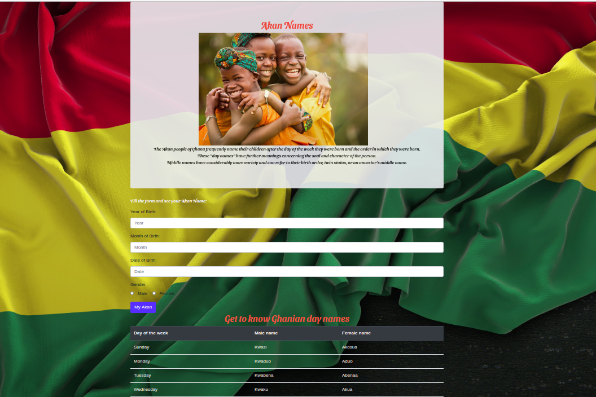

# Akan Name Generation

## Author
Sharon Anyango

## Github Repo Link
Click [here](https://github.com/sharon0812/Akan-Names-Generation) to view the project on github

## Live link
[akan-names-generation](https://sharon0812.github.io/Akan-Names-Generation/)

## Description
Web application that takes a user's birthday and calculates the day of the week they were born and then depending on their gender outputs their Akan Name. Akan names are derived from Ghanian culture. Frequently in Ghana, children are given their first name as a 'day name' which corresponds to the day in the week they were born.
## BDD
* Enter your date of birth in the form
* Enter your year of birth in the form
* Enter your month of bith in the form
* Submit the form
* You will recieve the alert stating your akan name
## languanges used
* JavaSript
* Html
* Css

## Contact
You can reach me via email: 
anyangosharon26@gmail.com

## Image Preview

## Lincense

Copyright (c) 2020 **( Akan names generation)**
